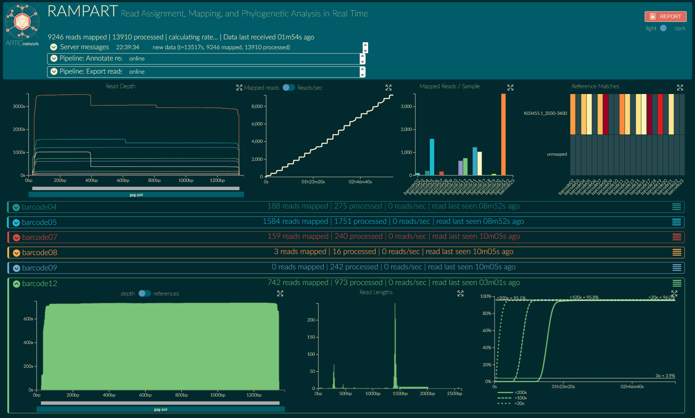

# Custom RAMPART protocol for real-time HIV-1 partial-pol gene sequencing
This configuration is designed to run [RAMPART](https://github.com/artic-network/rampart?tab=readme-ov-file) concurrently with Oxford Nanopore Technologies (ONT) MinKNOW sequencing, providing real-time visualization of read mapping, coverage, and reference matching to the HXB2 genome (~1.3 kb PR/RT region) for each barcode. Developed by the [ARTIC network](https://github.com/artic-network), RAMPART allows users to monitor sequencing progress live and assess read accumulation, helping to determine when sufficient coverage has been reached and the run can be stopped.

## Available RAMPART Protocols
This repository contains two RAMPART configurations for visualizing HIV-1 partial-pol amplicon sequencing in real time:

1. [`rampart-HIV-1_partial-pol`](./rampart-HIV-1_partial-pol) 
Uses the full HXB2 reference genome ([K03455.1](https://www.ncbi.nlm.nih.gov/nuccore/K03455.1)) for mapping and visualization. Suitable for users who prefer full-genome context during sequencing.

2. [`rampart-HIV-1_partial-pol_2030-3400`](./rampart-HIV-1_partial-pol_2030-3400) 
Uses a truncated version of the HXB2 reference (coordinates 2030–3400) corresponding to the amplified pol region. This streamlined version focuses only on the targeted amplicon and may improve clarity in real-time mapping.

These two options provide flexibility depending on whether you prefer full-genome or amplicon-focused visualization during sequencing.

## Associated Nanopore Sequencing Protocol
These RAMPART configurations are intended for use with the companion `HIV-1 partial-pol gene nanopore sequencing protocol` (published on protocols.io), which describes the upstream wet-lab workflow including RT-PCR, amplicon generation, and library prep.

## Running RAMPART with This Protocol

To run RAMPART with this protocol, use the following example commands:

```bash
rampart --protocol ~/rampart-HIV-1_partial-pol --basecalledPath /path/to/fastq_pass/folder/
```
or
```bash
rampart --protocol ~/rampart-HIV-1_partial-pol_2030-3400 --basecalledPath /path/to/fastq_pass/folder/
```
Please ensure you follow the official [RAMPART](https://github.com/artic-network/rampart?tab=readme-ov-file) installation and usage guidelines! 

## Example RAMPART Output
This is an example of the real-time view generated using the `rampart-HIV-1_partial-pol_2030-3400` protocol.  
It shows barcode-specific read depth, mapping to the pol region (HXB2: 2030–3400), and reference match performance.



## Related Publication
Please cite the associated publications when using or adapting this workflow.

This protocol was used in:

**Kovalenko et al., 2023**. *Phylodynamics and migration data help describe HIV transmission dynamics in internally displaced people who inject drugs in Ukraine.*  
[PNAS Nexus, pgad008](https://doi.org/10.1093/pnasnexus/pgad008)

📌 An additional publication describing the mobile HIV-1 sequencing application is forthcoming. The citation and link will be added here once available.
